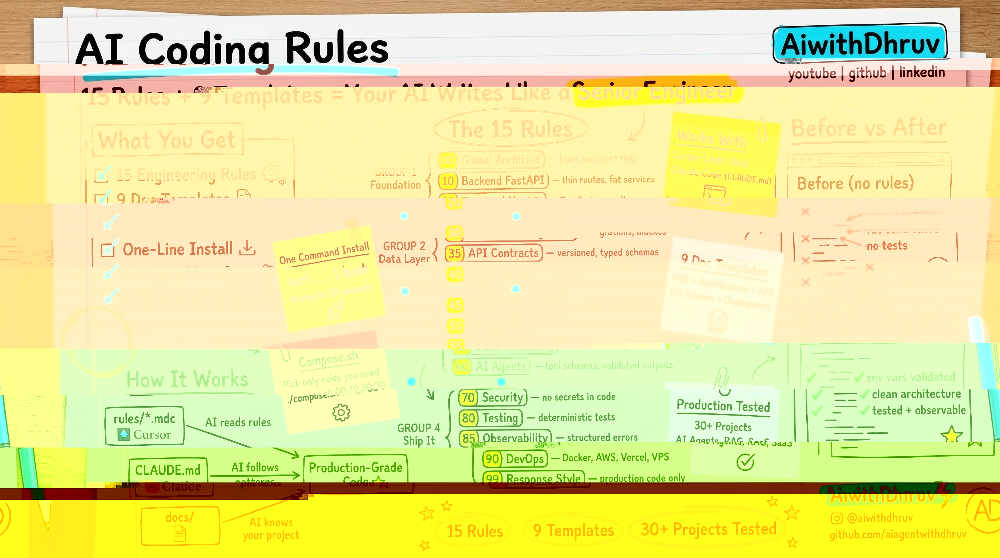

# skills

<p align="center">
  
</p>

Production-grade rules, docs, and patterns for AI-native full-stack development. Works with **Cursor** and **Claude Code**.

15 engineering rules + 9 doc templates + skills guide + agent patterns + MCP setup. Drop into any project — your AI coding tool immediately thinks like a senior engineer.

## Quick Start

### Cursor
```bash
curl -fsSL https://raw.githubusercontent.com/kaushraj1/skills/main/install.sh | bash
```

### Claude Code
```bash
curl -fsSL https://raw.githubusercontent.com/kaushraj1/skills/main/claude/CLAUDE.md -o CLAUDE.md
```

### Both (recommended)
```bash
curl -fsSL https://raw.githubusercontent.com/kaushraj1/skills/main/install.sh | bash
curl -fsSL https://raw.githubusercontent.com/kaushraj1/skills/main/claude/CLAUDE.md -o CLAUDE.md
```

## What's inside

```
skills/
├── rules/                          # 15 Cursor rules (.mdc)
├── claude/                         # Claude Code setup
│   ├── CLAUDE.md                   # All 15 rules in one file
│   ├── compose.sh                  # Build custom CLAUDE.md
│   ├── rules/                      # 15 individual rule files
│   └── .claude/settings.json       # Permission config template
├── docs/                           # 9 project templates
│   ├── PRD.md                      # Product requirements
│   ├── ARCHITECTURE.md             # System architecture + data flow
│   ├── API_SPEC.md                 # API endpoints + response format
│   ├── DB_SCHEMA.md                # Tables, columns, indexes
│   ├── DEPLOYMENT.md               # Local + AWS + Vercel + VPS + CI/CD
│   ├── SKILLS.md                   # How to create and use skills
│   ├── AGENTS.md                   # Subagent patterns and templates
│   ├── LOADOUT.md                  # Project manifest template
│   └── MCP.md                      # MCP server setup guide
├── install.sh                      # One-liner installer
└── LICENSE
```

## The 15 Rules

| # | Rule | What it enforces |
|---|------|-----------------|
| 00 | **Global Architect** | Think architect-first. Clean architecture. Separation of concerns. |
| 10 | **Backend FastAPI** | Thin routes. Services for logic. Repositories for DB. |
| 20 | **Frontend Next.js** | TypeScript. Small components. Centralized API clients. |
| 30 | **Database PostgreSQL** | Migrations. Indexes. Foreign keys. No raw SQL in routes. |
| 35 | **API Contracts** | Version APIs. Typed schemas. Consistent error format. |
| 40 | **Cache Redis** | Intentional TTLs. Stable keys. Wrapped access. |
| 45 | **Environment Config** | Validate at startup. .env.example. Secret managers. |
| 50 | **RAG System** | Separate ingestion from generation. Chunk metadata. |
| 55 | **Data & Model Versioning** | Version datasets. Named checkpoints. Reproducibility. |
| 60 | **Agents** | Tool schemas. Validated outputs. Supervisor patterns. |
| 70 | **Security** | No hardcoded secrets. Prompt injection resistance. |
| 80 | **Testing & Quality** | Tests for critical paths. Deterministic units. Linting. |
| 85 | **Error & Observability** | Structured errors. Request tracing. Health checks. |
| 90 | **DevOps & Deployment** | Docker. AWS. Vercel. VPS. CI/CD. |
| 99 | **Response Style** | Minimal changes. Production code. No toy implementations. |

## The 9 Doc Templates

| Doc | What it defines | Why it matters |
|-----|----------------|----------------|
| **PRD.md** | Product requirements, users, milestones | AI knows **what** to build |
| **ARCHITECTURE.md** | Layers, data flow, key decisions | AI knows **how** it's structured |
| **API_SPEC.md** | Endpoints, response format, patterns | AI writes **consistent APIs** |
| **DB_SCHEMA.md** | Tables, columns, types, indexes | AI writes **correct queries** |
| **DEPLOYMENT.md** | Local + cloud + CI/CD setup | AI writes **deploy-ready code** |
| **SKILLS.md** | Reusable automation capabilities | AI **reuses** before rebuilding |
| **AGENTS.md** | Subagent patterns, templates | AI **delegates** complex tasks |
| **LOADOUT.md** | Project manifest template | AI gets **instant context** |
| **MCP.md** | External tool integrations | AI **connects** to services |

## How It Works

### Rules tell AI **how** to code
```
"Use clean architecture"
"Never hardcode secrets"
"Use Pydantic for validation"
```

### Docs tell AI **what** you're building
```
"We have 12 tables with multi-tenant isolation"
"API uses /api/v1/ prefix with JWT auth"
"Deploy to AWS ECS with GitHub Actions"
```

### Skills tell AI **what** to automate
```
"Use the deploy skill to push to production"
"Use the scrape-leads skill for lead generation"
```

The `00-global-architect` rule auto-references your docs:
```
Before implementing, align with docs/PRD.md, docs/ARCHITECTURE.md,
docs/API_SPEC.md, docs/DB_SCHEMA.md, and docs/DEPLOYMENT.md if present.
```

## Cursor vs Claude Code

| | Cursor | Claude Code |
|---|---|---|
| Format | `.mdc` with YAML frontmatter | `.md` plain markdown |
| Location | `.cursor/rules/` | `CLAUDE.md` at project root |
| Multiple files | 15 numbered files | 1 combined or subdirectory split |
| Triggers | alwaysApply, globs, manual | Always loaded from current dir |
| Install | `install.sh` | Single file copy |

Use both in the same project — zero conflict:
```
your-project/
├── .cursor/rules/*.mdc     # Cursor reads these
├── CLAUDE.md               # Claude Code reads this
└── docs/                   # Both reference these
```

## Customization

### Swap frameworks

Don't use Next.js? Replace `20-frontend-nextjs`:
- React + Vite, SvelteKit, Nuxt, Angular

Don't use FastAPI? Replace `10-backend-fastapi`:
- Express, Django, Go, Rails

### Add custom rules

Cursor — create `05-my-rule.mdc` in `.cursor/rules/` (gap numbering, fits between 00 and 10).

Claude Code — add a section to `CLAUDE.md`.

### Compose Claude rules

Pick only what you need:
```bash
cd skills/claude
./compose.sh 00 10 30 70 80 99 > ~/project/CLAUDE.md    # Backend only
./compose.sh 00 20 70 80 99 > ~/project/CLAUDE.md        # Frontend only
./compose.sh 00 50 55 60 70 99 > ~/project/CLAUDE.md     # AI/ML only
./compose.sh > ~/project/CLAUDE.md                         # Everything
```

## Related

- **[skills](https://github.com/kaushraj1/skills)** — 38 reusable AI agent skills (lead gen, email, video, deployment). Install: `npx skills add kaushraj1/skills`

`skills` = **how to set up your AI coding environment**
`skills` = **what to automate with AI agents**

## Credits

Built by [@kaushal](https://github.com/kaushraj1) with Claude Code.

Production-tested across 30+ projects — AI agents, RAG systems, SaaS products, and client work.

## License

MIT — use it, fork it, ship better code.
